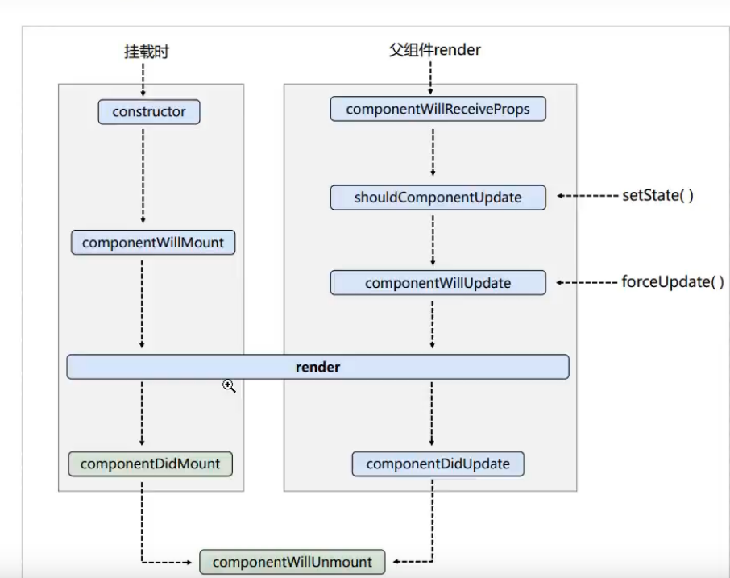
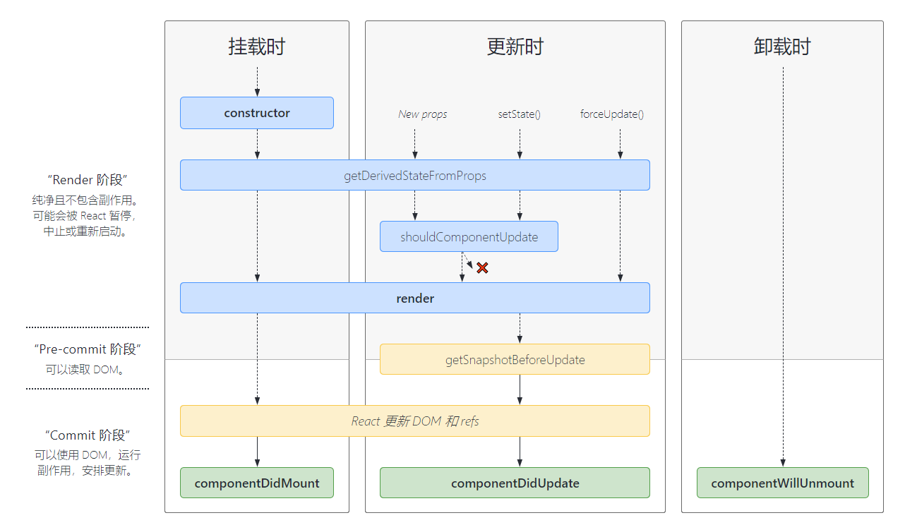

## React尚硅谷笔记

### 相关url

- ###### [1.英文官网: https://reactjs.org/](https://reactjs.org/)

- ###### [2.中文官网: https://react.docschina.org/](https://react.docschina.org/)

- [尚硅谷笔记1](https://github.com/xzlaptt/React)

- [尚硅谷笔记2](http://notes.xiyanit.cn/#/start/)

### React入门

#### 1 基础案例

- 引入三个包

```js
react.development.js  // React核心库
react-dom.development.js	// DOM操作库
babel.min.js 	// 解析JSX语法
```

- 创建一个容器
- 创建虚拟DOM渲染到容器中

#### 2 jsx基础语法

- 虚拟Dom不能使用""
- 标签混入**Js表达式**使用{}    
- 样式类名使用ClassName
- 内联样式传入对象，驼峰命名
- 只能有一个跟标签
- 标签必须闭合
- 标签名小写字母，则识别为html同名元素；大写开头，识别为组件

#### 3 创建虚拟DOM

- JSX创建
- JS创建（几乎不用）

```js
// 1.创建虚拟DOM[在这使用了js的语法]React.createElement(标签,标签属性,内容)
const VDOM = React.createElement('h1',{id:"title"},"nihao")
```

#### 4 组件

- **函数式组件**（可使用props，作为参数传入，无state和refs）

```js
//1.先创建函数，函数可以有参数，也可以没有，但是必须要有返回值 返回一个虚拟DOM
function Welcome(props) {
  return <h1>Hello, {props.name}</h1>;
}
//2.进行渲染
ReactDOM.Render(<Welcom name = "ss" />,document.getElementById("div"));
```

- **class组件**  
    -  React解析组件标签，找到相应的组件
    - 发现组件是类定义的，随后new出来的类的实例，并通过该实例调用到原型上的render方法
    - 将render返回的虚拟DOM转化为真实的DOM,随后呈现在页面中

```jsx
//必须继承React.Component
//然后重写Render()方法，该方法一定要有返回值，返回一个虚拟DOM
class Welcome extends React.Component {
  render() {
    return <h1>Hello, {this.props.name}</h1>;
  }
}
//渲染 【这个跟之前也是一样的】
ReactDOM.Render(<Welcom name = "ss" />,document.getElementById("div"));
```

#### 5 组件三大属性 state

**注意**

- state的赋值可以不再构造函数中进行
- 渲染，如果有多个渲染同一个容器，后面的会将前面的覆盖掉
- 如果使用构造函数，必须传递一个props参数，并super(props)，否则将导致props不可见
- **类中所有方法开启了严格模式** 注意this指向问题，用箭头函数解决

**this.setState()**：

- 合并原先的值

- 接收两种参数：对象或函数
    - 对象：即想要修改的state
    - 函数：接收两个函数，第一个函数接受两个参数，第一个是当前state，第二个是当前props，该函数返回一个对象，和直接传递对象参数是一样的，就是要修改的state；第二个函数参数是state改变后触发的回调

**<span style="color:red">setState有异步更新和同步更新两种形式</span>**

- React控制之外的事件中调用setState是同步更新的。比如原生js绑定的事件，setTimeout/setInterval等。
- 大部分开发中用到的React封装的事件，比如onChange、onClick、onTouchMove等，这些事件处理程序中的setState都是异步处理
- 如果是同步更新，每一个setState对调用一个render
- 如果是异步更新，多个setSate会统一调用一次render

#### 6 组件三大属性 props

**注意**

- ...传递对象
- {...obj}复制对象，{...obj,key:value}合并属性
- **props传递一个对象，是因为babel+react使得{..p}可以展开对象，但是只有在标签中才能使用**

```jsx
ReactDOM.render(<Person {...p}/>,document.getElementById("div"));
```

- 限制参数类型
    - propTypes:类型检查，还可以限制不能为空
    - defaultProps：默认值

- 函数组件可使用props属性

#### 7 组件三大属性 refs

**三大形式**

- 字符串形式

```jsx
<input ref="dian" type="text" placeholder="点击弹出" />

 inputBlur = () =>{
   alert(this.refs.dian.value);      
 }
```

- 回调形式

```jsx
<input ref={self =>{ this.dian = self;console.log(self)}}  placeholder="点击弹出" />  // 将DOM元素作为参数传入
```

- API形式

```jsx
MyRef = React.createRef(); // 一个容器存放一个
MyRef1 = React.createRef();
<input ref={this.MyRef} type="text" placeholder="点击弹出" />
<input ref={this.MyRef1} type="text" placeholder="点击弹出" />
btnOnClick = () =>{
    //创建之后，将自身节点，传入current中
    console.log(this.MyRef.current.value);	
}
```

- **不要过度的使用ref，如果发生时间的元素刚好是需要操作的元素，就可以使用事件去替代**

#### 8 React事件

**注意**

- React的事件是通过onXxx属性指定事件处理函数
- React使用的都是自定义的事件，而不是原生的事件
- React中的事件是通过事件委托方式处理的
- 事件中必须返回的是函数
- 通过event.target得到发生事件的Dom元素对象

**受控组件**

- 输入的值始终由 React 的 state 驱动。

**非受控组件**

- 非受控组件其实就是表单元素的值不会更新state。输入数据都是现用现取的。

**高阶函数**

- 函数的参数或返回值是函数
- **函数柯里化**：返回值是函数实现多次接收函数统一处理

#### 9  生命周期

**（旧）**



**（新）**



- 抛弃了WillMount,WillReceiveProps,WillUpdate函数    UNSAFE_ 前缀

- **static getDerivedStateFromProps(props, state)**

    - 返回一个Null或者state对象。
    - *若state的值在任何时候都取决于props，那么可以使用getDerivedStateFromProps*

- **getSnapshotBeforeUpdate(prevProps, prevState)**

    - 返回值作为参数传递给componentDidUpdate

    - componentDidUpdate(prevProps, prevState, snapshot)

        该生命周期函数，可以有三个参数：原始传过来的参数，最开始的状态，getSnapshotBeforeUpdate传递的值

#### 10 Diffing算法和Key

- 虚拟DOM中key的作用：

    当状态中的数据发生变化时，react会根据【新数据】生成【新的虚拟DOM】, 随后React进行【新虚拟DOM】与【旧虚拟DOM】的diff比较，比较规则如下：

​		a. 旧虚拟DOM中找到了与新虚拟DOM相同的key：

​            (1).若虚拟DOM中内容没变, 直接使用之前的真实DOM

​            (2).若虚拟DOM中内容变了, 则生成新的真实DOM，随后替换掉页面中之前的真实DOM

​         b. 旧虚拟DOM中未找到与新虚拟DOM相同的key

​            根据数据创建新的真实DOM，随后渲染到到页面

- 用index作为key可能会引发的问题：

​        1. 若对数据进行：逆序添加、逆序删除等破坏顺序操作:

​            会产生没有必要的真实DOM更新 ==> 界面效果没问题, 但效率低。

​        2. 如果结构中还包含输入类的DOM：

​            会产生错误DOM更新 ==> 界面有问题。

​        3. 注意！如果不存在对数据的逆序添加、逆序删除等破坏顺序操作，

​         仅用于渲染列表用于展示，使用index作为key是没有问题的。

- 开发中如何选择key?:

​        1.最好使用每条数据的唯一标识作为key, 比如id、手机号、身份证号、学号等唯一值。

​        2.如果确定只是简单的展示数据，用index也是可以的。

### React脚手架

#### 一、todoList案例相关知识点

		1.拆分组件、实现静态组件，注意：className、style的写法
		2.动态初始化列表，如何确定将数据放在哪个组件的state中？
					——某个组件使用：放在其自身的state中
					——某些组件使用：放在他们共同的父组件state中（官方称此操作为：状态提升）
		3.关于父子之间通信：
				1.【父组件】给【子组件】传递数据：通过props传递
				2.【子组件】给【父组件】传递数据：通过props传递，要求父提前给子传递一个函数
		4.注意defaultChecked 和 checked的区别，类似的还有：defaultValue 和 value
		5.状态在哪里，操作状态的方法就在哪里

#### 二、github搜索案例相关知识点

		1.设计状态时要考虑全面，例如带有网络请求的组件，要考虑请求失败怎么办。
		2.ES6小知识点：解构赋值+重命名
					let obj = {a:{b:1}}
					const {a} = obj; //传统解构赋值
					const {a:{b}} = obj; //连续解构赋值
					const {a:{b:value}} = obj; //连续解构赋值+重命名
		3.消息订阅与发布机制 PubSubJs
					1.先订阅，再发布（理解：有一种隔空对话的感觉）
					2.适用于任意组件间通信
					3.要在组件的componentWillUnmount中取消订阅
		4.fetch发送请求（关注分离的设计思想）
					try {
						const response= await fetch(`/api1/search/users2?q=${keyWord}`)
						const data = await response.json()
						console.log(data);
					} catch (error) {
						console.log('请求出错',error);
					}


#### 三、路由的基本使用

			1.明确好界面中的导航区、展示区
			2.导航区的a标签改为Link标签
						<Link to="/xxxxx">Demo</Link>
			3.展示区写Route标签进行路径的匹配
						<Route path='/xxxx' component={Demo}/>
			4.<App>的最外侧包裹了一个<BrowserRouter>或<HashRouter>

#### 四、路由组件与一般组件

			1.写法不同：
						一般组件：<Demo/>
						路由组件：<Route path="/demo" component={Demo}/>
			2.存放位置不同：
						一般组件：components
						路由组件：pages
			3.接收到的props不同：
						一般组件：写组件标签时传递了什么，就能收到什么
						路由组件：接收到三个固定的属性
											history:
														go: ƒ go(n)
														goBack: ƒ goBack()
														goForward: ƒ goForward()
														push: ƒ push(path, state)
														replace: ƒ replace(path, state)
											location:
														pathname: "/about"
														search: ""
														state: undefined
											match:
														params: {}
														path: "/about"
														url: "/about"

#### 五、NavLink与封装NavLink

				1.NavLink可以实现路由链接的高亮，通过activeClassName指定样式名

#### 六、Switch的使用

				1.通常情况下，path和component是一一对应的关系。
				2.Switch可以提高路由匹配效率(单一匹配)。

#### 七、解决多级路径刷新页面样式丢失的问题

				刷新时找不到会默认返回index.html
				1.public/index.html 中 引入样式时不写 ./ 写 / （常用）
				2.public/index.html 中 引入样式时不写 ./ 写 %PUBLIC_URL% （常用）
				3.使用HashRouter

#### 八、路由的严格匹配与模糊匹配

				1.默认使用的是模糊匹配（简单记：【输入的路径】必须包含要【匹配的路径】，且顺序要一致）
				2.开启严格匹配：<Route exact={true} path="/about" component={About}/>
				3.严格匹配不要随便开启，需要再开，有些时候开启会导致无法继续匹配二级路由

#### 九、Redirect的使用	

				1.一般写在所有路由注册的最下方，当所有路由都无法匹配时，跳转到Redirect指定的路由
				2.具体编码：
						<Switch>
							<Route path="/about" component={About}/>
							<Route path="/home" component={Home}/>
							<Redirect to="/about"/>
						</Switch>

#### 十、嵌套路由

				1.注册子路由时要写上父路由的path值
				2.路由的匹配是按照注册路由的顺序进行的

#### 十一、向路由组件传递参数

				1.params参数
							路由链接(携带参数)：<Link to='/demo/test/tom/18'}>详情</Link>
							注册路由(声明接收)：<Route path="/demo/test/:name/:age" component={Test}/>
							接收参数：this.props.match.params
				2.search参数
							路由链接(携带参数)：<Link to='/demo/test?name=tom&age=18'}>详情</Link>
							注册路由(无需声明，正常注册即可)：<Route path="/demo/test" component={Test}/>
							接收参数：this.props.location.search
							备注：获取到的search是urlencoded编码字符串，需要借助querystring解析
				3.state参数
							路由链接(携带参数)：<Link to={{pathname:'/demo/test',state:{name:'tom',age:18}}}>详情</Link>
							注册路由(无需声明，正常注册即可)：<Route path="/demo/test" component={Test}/>
							接收参数：this.props.location.state
							备注：刷新也可以保留住参数(在historym)

#### 十二、编程式路由导航

					借助this.prosp.history对象上的API对操作路由跳转、前进、后退
							-this.prosp.history.push()
							-this.prosp.history.replace()
							-this.prosp.history.goBack()
							-this.prosp.history.goForward()
							-this.prosp.history.go()

#### 十三、BrowserRouter与HashRouter的区别

			1.底层原理不一样：
						BrowserRouter使用的是H5的history API，不兼容IE9及以下版本。
						HashRouter使用的是URL的哈希值。
			2.path表现形式不一样
						BrowserRouter的路径中没有#,例如：localhost:3000/demo/test
						HashRouter的路径包含#,例如：localhost:3000/#/demo/test
			3.刷新后对路由state参数的影响
						(1).BrowserRouter没有任何影响，因为state保存在history对象中。
						(2).HashRouter刷新后会导致路由state参数的丢失！！！
			4.备注：HashRouter可以用于解决一些路径错误相关的问题。

#### 十四、antd的按需引入+自定主题

			1.安装依赖：yarn add react-app-rewired customize-cra babel-plugin-import less less-loader
			2.修改package.json
					....
						"scripts": {
							"start": "react-app-rewired start",
							"build": "react-app-rewired build",
							"test": "react-app-rewired test",
							"eject": "react-scripts eject"
						},
					....
			3.根目录下创建config-overrides.js
					//配置具体的修改规则
					const { override, fixBabelImports,addLessLoader} = require('customize-cra');
					module.exports = override(
						fixBabelImports('import', {
							libraryName: 'antd',
							libraryDirectory: 'es',
							style: true,
						}),
						addLessLoader({
							lessOptions:{
								javascriptEnabled: true,
								modifyVars: { '@primary-color': 'green' },
							}
						}),
					);
				4.备注：不用在组件里亲自引入样式了，即：import 'antd/dist/antd.css'应该删掉

### react脚手架配置代理总结

#### 方法一

> 在package.json中追加如下配置

```json
"proxy":"http://localhost:5000"
```

说明：

1. 优点：配置简单，前端请求资源时可以不加任何前缀。
2. 缺点：不能配置多个代理。
3. 工作方式：上述方式配置代理，当请求了3000不存在的资源时，那么该请求会转发给5000 （优先匹配前端资源）

#### 方法二

1. 第一步：创建代理配置文件

    ```
    在src下创建配置文件：src/setupProxy.js
    ```

2. 编写setupProxy.js配置具体代理规则：

    ```js
    const proxy = require('http-proxy-middleware')
    
    module.exports = function(app) {
      app.use(
        proxy('/api1', {  //api1是需要转发的请求(所有带有/api1前缀的请求都会转发给5000)
          target: 'http://localhost:5000', //配置转发目标地址(能返回数据的服务器地址)
          changeOrigin: true, //控制服务器接收到的请求头中host字段的值
          /*
          	changeOrigin设置为true时，服务器收到的请求头中的host为：localhost:5000
          	changeOrigin设置为false时，服务器收到的请求头中的host为：localhost:3000
          	changeOrigin默认值为false，但我们一般将changeOrigin值设为true
          */
          pathRewrite: {'^/api1': ''} //去除请求前缀，保证交给后台服务器的是正常请求地址(必须配置)
        }),
        proxy('/api2', { 
          target: 'http://localhost:5001',
          changeOrigin: true,
          pathRewrite: {'^/api2': ''}
        })
      )
    }
    ```

说明：

1. 优点：可以配置多个代理，可以灵活的控制请求是否走代理。
2. 缺点：配置繁琐，前端请求资源时必须加前缀。